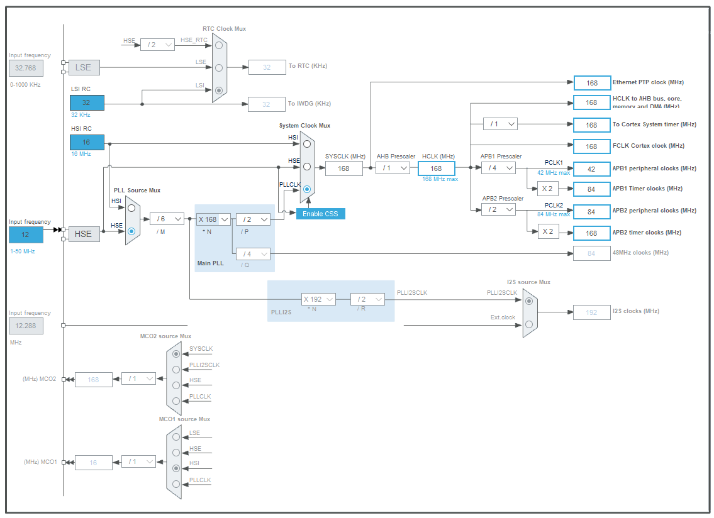
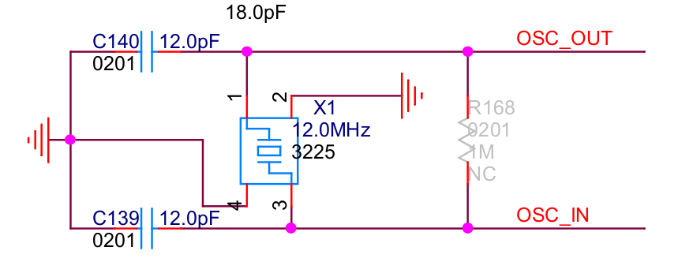

# Class 2 外设与延时

[【嵌入式小白的学习之路】2. Ubuntu嵌入式开发-基础外设与延时](https://www.bilibili.com/video/BV1414y1R7dC/)

## 目标

1. 使用GPIO，点亮RGB
2. 配置时钟，理解时钟树，自己计算并写一个Delay函数

## Target 1: 使用GPIO

查询C板手册，看看LED的引脚，配置好工程。使用的是STM32F407IGH6。

在cubeMX中配置调试下载端口、GPIO引脚、生成代码

使用HAL_GPIO_WritePin可以点灯。

把光标放在HAL_GPIO_WritePin函数上，按下Ctrl可以跳转至它的实现。

添加如下点灯代码，我们会发现板子上亮起了五彩斑斓的白光。
```c
/* USER CODE BEGIN WHILE */
  while (1)
  {
    HAL_GPIO_WritePin(LED_B_GPIO_Port,LED_B_Pin,GPIO_PIN_SET);
    HAL_GPIO_WritePin(LED_G_GPIO_Port,LED_G_Pin,GPIO_PIN_SET);
    HAL_GPIO_WritePin(LED_R_GPIO_Port,LED_R_Pin,GPIO_PIN_SET);
    /* USER CODE END WHILE */

    /* USER CODE BEGIN 3 */
  }
  /* USER CODE END 3 */

```

注意！我们的代码需要写在*User Code Begin*里面，否则在CubeMX修改配置再次生成代码的时候，代码会被覆盖。这个时候只能一边哭一边被队友骂了。

## Target 2 时钟树配置

使用cubeMX在图形化界面上直接修改时钟树的配置。

对于MCU时钟树的配置，我们主要参考其官方文档



时钟树配置有三点需要注意：时钟源、MCU主频SYSCLK、树枝所需频率

时钟源一般有三种来源，分别是晶体振荡器、内部时钟、旁路时钟。其中我们常使用外部的晶体振荡器。在C板上，我们查阅原理图得知使用的是12M的晶振。



我们将输入频率改为12MHz，并选择HSE - High Speed External

MCU的主频——系统时钟，系统时钟便是我们执行一个指令周期所需要的时间，可以用于定时。我们之间设为最大的168MHz。

另外树枝需要的频率则是时钟树末端的这一部分。系统时钟将会分频到各个外设及低速总线所需要的频率，我们直接设置树枝所需要的频率就可以，cubeMX会帮我们进行自动设置分频系数。

## Target 3 LED闪烁

参考教程文档定时器闪烁LED部分

定时方法有三种：HAL_Delay延时方法、nop延时方法、以及定时器延时，这里我们将先介绍前面两种

### HAL_Delay延时方法

使用HAL_Delay函数是最简单的，我们按住Ctrl点击这个函数跳转到它的实现，这个函数只有一个参数，延时的毫秒数。

```c
  /* USER CODE BEGIN WHILE */
  while (1)
  {
    HAL_GPIO_WritePin(LED_B_GPIO_Port,LED_B_Pin,GPIO_PIN_SET);
    HAL_Delay(100);
    HAL_GPIO_WritePin(LED_B_GPIO_Port,LED_B_Pin,GPIO_PIN_RESET);
    HAL_Delay(100);
    /* USER CODE END WHILE */

    /* USER CODE BEGIN 3 */
  }
  /* USER CODE END 3 */

```

下面的代码也可以达到同样的效果，TogglePin直接可以实现IO引脚电平的翻转。

```c
/* USER CODE BEGIN WHILE */
  while (1)
  {
    HAL_GPIO_TogglePin(LED_B_GPIO_Port,LED_B_Pin);
    HAL_Delay(100);
    /* USER CODE END WHILE */

    /* USER CODE BEGIN 3 */
  }
  /* USER CODE END 3 */
  ```

但使用HALdelay只能完成毫秒级别的延时，无法完成微秒级别的延时。

### nop延时方法

通过重复执行指令，消耗时间，再进行下一步的工作。nop 延时通过空操作指令__nop()函数来实现延时。当 stm32 执行到__nop()时，可以理解为在当前指令周期中，stm32 没有进行任何工作。

通过循环的方式，可以完成微秒级的延迟 nop_delay_us 和毫秒级的延时nop_delay_ms。
首先在PFP里声明函数：

```c
/* USER CODE BEGIN PFP */
void nop_delay_us(uint16_t us);
void nop_delay_ms(uint16_t ms);
/* USER CODE END PFP */
```

函数定义为：

这里有15个nop，如何计算得来的？主频率168MHz，一个机器周期为1/168 us。

```c
/* USER CODE BEGIN 4 */
void nop_delay_us(uint16_t us)
{
  for(;us>0;us--)
  {
    for(uint8_t i=10;i>0;i--)
    {
      __NOP();
      __NOP();
      __NOP();
      __NOP();
      __NOP();
      __NOP();
      __NOP();
      __NOP();
      __NOP();
      __NOP();
      __NOP();
      __NOP();
      __NOP();
      __NOP();
      __NOP();
    }
  }  
}

void nop_delay_ms(uint16_t ms)
{
  for(;ms>0;ms--)
  {
    nop_delay_us(1000);
  }
}
/* USER CODE END 4 */
```

主函数中测试：

```c
/* USER CODE BEGIN WHILE */
  while (1)
  {
    for(uint16_t i=10000;i>0;i--)
    {
      HAL_GPIO_TogglePin(LED_B_GPIO_Port,LED_B_Pin);
      nop_delay_us(i);
    }
    
    /* USER CODE END WHILE */

    /* USER CODE BEGIN 3 */
  }
  /* USER CODE END 3 */


```
