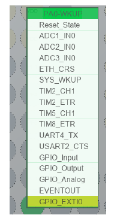
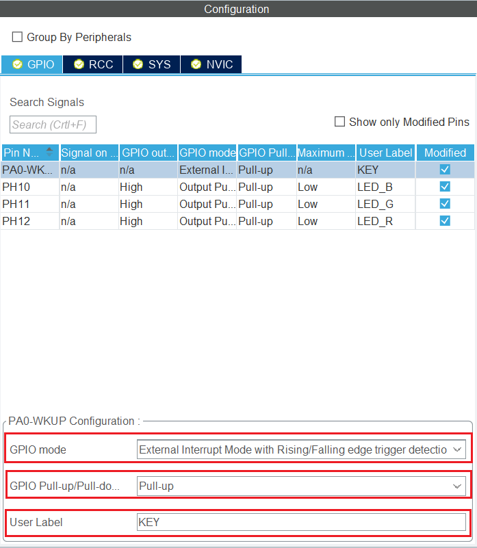
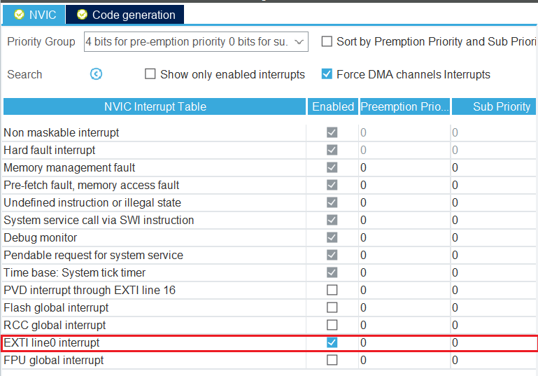

# Class 3 按键与LED

这一课我们来学最基础的输入输出的使用。

[【嵌入式小白的学习之路】3. Ubuntu嵌入式开发-按键与中断](https://www.bilibili.com/video/BV1Ug4y1w7SN)

## 一、本次的目标

实现内容：使用中断和去抖，按键按下时，LED亮起，松开时LED熄灭。
学习内容：

- GPIO输入
- 按键中断
- 按键去抖

## 二、原理简介

### 1. 中断简介

在 STM32 中，对信号的处理可以分为轮询方式和中断方式，轮询方式就是不断去访问一个信号的端口，看看有没有信号进入，有则进行处理，中断方式则是当输入产生的时候，产生一个触发信号告诉 STM32 有输入信号进入，需要进行处理。

轮询就好比你反复查看手机，看看有没有人找你，这样你第一时间就可以做出回应，而中断则是手机发出提示音，第一时间提示你有人找你，这样你没有收到提示的时候就可以进行其它工作，这样效率更高。

每一种中断都有对应的中断函数，当中断发生时，程序会自动跳转到处理函数处运行，而不需要人为进行调用。

// 这里我们不赘述中断的底层实现，主要针对STM32中断执行进行研究。

### 2. 外部中断

外部中断通常是GPIO的电平跳变引起的中断。在stm32中，每一个GPIO都可以作为外部中断的触发源，外部中断一共有16条线，对应着GPIO的0-15引脚，每一条外部中断都可以与任意一组的对应引脚相连，但不能重复使用。例如外部中断Line0可以和PA0，PB0，PC0等任意一条0号引脚相连，但如果已经和PA0相连，就不能同时和PB0，PC0其他引脚相连。

外部中断支持GPIO的三种电平跳变模式，如下所示：

- 上升沿中断：当GPIO的电平从低电平跳变成高电平时，引发外部中断。
- 下降沿中断：当GPIO的电平从高电平跳变成低电平时，引发外部中断。
- 上升沿和下降沿中断：当GPIO的电平从低电平跳变成高电平和从高电平跳变成低电平时，都能引发外部中断。

### 3. 按键的使用与去抖

按键是嵌入式最基础的输入设备。在我们使用的C板的侧面有个用户按键，原理图如下：


通过查询C板资料，我们可以知道按键连接到PA0上，并且配有硬件消抖。

按键输入的抖动问题

由于按键的机械结构具有弹性，按下时开关不会立刻接通，断开时也不会立刻断开，这就导致按键的输入信号在按下和断开时都会存在抖动，如果不先将抖动问题进行处理，则读取的按键信号可能会出现错误。

为了消除这一问题，可以通过软件消抖和硬件消抖两种方式来实现，本节介绍软件滤波的实现方法。软件滤波的思想非常简单，抖动产生在按键按下和松开的两个边沿时刻，也叫下降沿（电平从高到低）和上升沿（电平从低到高）时刻，所以只需要在边沿时进行延时，等到按键输入已经稳定再进行信号读取即可。

通常认为按键机械抖动的最大周期是20ms，所以一般采用软件消抖时，会进行20ms的延时。

## 三、手把手教实践

1. 在cubeMX中配置按键外部中断，stm32中断优先级理解，cubeMX中的中断配置，中断函数管理
2. 外部中断回调函数介绍
3. 外部中断初始化函数调用`HAL_TIM_Base_Start` 函数

### 1. 外部中断在cubeMX中的配置

STM32的GPIO提供外部中断功能，当GPIO检测到电压跳变时，就会发出中断触发信号给STM32，使程序进入外部中断服务函数。

将PA0号引脚设置为按键的输入引脚，将其设置为外部中断模式。



接着点开GPIO标签页，对引脚进行如下设置，将GPIO模式设置为升降沿触发的外部中断，上下拉电阻设置为上拉电阻，最后设置用户标签为KEY。



外部中断一共有三种触发方式：上升沿触发，下降沿触发和上下沿均触发。

在NVIC标签页下，可以看到外部中断已经开启。NVIC是STM32专门用于处理中断的控制器，即嵌套向量中断控制器 (Nested Vectored Interrupt Controller)。

NVIC的功能非常强大，支持中断优先级和中断嵌套的功能，中断优先级即给不同的中断划分不同的响应等级，如果多个中断同时产生，则STM32优先处理高优先级的中断。

中断嵌套即允许在处理中断时，如果有更高优先级的中断产生，则挂起当前中断，先去处理产生的高优先级中断，处理完后再恢复到原来的中断继续处理。

这个过程理解起来就像是在上文的情境中，手机上有消息提醒，同时一个电话打了进来，我们会先去接电话，挂掉电话之后再去处理手机消息。

在NVIC配置界面中，我们可以看到NVIC中断表、中断的使能情况、抢占优先级和响应优先级。这是为了在有限的寄存器位数中实现更加丰富的中断优先级，NVIC使用的中断分组机制。STM32将先将中断进行分组，然后又将优先级划分为抢占优先级 (Prem priority) 和响应优先级 (Subpriority)。当多个中断发生时，先根据抢占优先级判断哪个中断分组能够优先响应，再到这个中断分组中根据各个中断的响应优先级判断哪个中断优先响应。拥有相同抢占优先级的中断处于同一个中断分组下。

*我们勾选外部中断1使能，这里我们设置优先级为默认的0，0就可以。*



### 2. 中断回调函数

每当产生外部中断时，程序首先会进入外部中断服务函数。在stm32f4xx_it.c中，可以找到函数`EXTI0_IRQHandler`，它通过调用函数`HAL_GPIO_EXTI_IRQHandler`对中断类型进行判断，并对涉及中断的寄存器进行处理，在处理完成后，它将调用中断回调函数`HAL_GPIO_EXTI_Callback`，在中断回调函数中编写在此次中断中需要执行的功能。也是实际上在我们HAL库的实践中最重要的一步。

编写中断运行时执行程序时，需要注意尽量避免在其中执行过长或者过于耗时的代码能够尽快执行完毕，以保证其能够实时响应突发的事件，比较繁杂和耗时的任务在后台中运行。

### 3. 程序设计

我们定义`rising_falling_flag`与`exit_flag`。使用`exit_flag`来实现主循环和中断回调函数之间的互斥，保证中断处理函数中的功能（判断上升/下降沿）只在主循环完成判断之后进行，或者主循环的判断只在中断处理函数运行（即检测到了一次上升沿或者下降沿）之后再进行。

```c
/* USER CODE BEGIN PV */
int rising_falling_flag;
/* USER CODE END PV */
```


在主循环中，首先通过边沿检测标志rising_falling_flag（在一开始声明变量）来判断按键是处于按下还是松开的边沿，如果是下降的边沿（rising_falling_flag == GPIO_PIN_RESET）则将LED灯点亮，如果是如果是上升的边沿（rising_falling_flag == GPIO_PIN_SET）则将LED灯熄灭。

为了防止误触发，通过边沿检测的判断之后，程序还会再对电平进行一次读取，确认下降沿后跟随的是低电平或者上升沿后跟随的是高电平，如果不是则不切换LED状态。

```c
while (1)
{
    if(exit_flag){
      if(rising_falling_flag==GPIO_PIN_RESET){
        if(!HAL_GPIO_ReadPin(KEY_GPIO_Port,KEY_Pin)){
          HAL_GPIO_WritePin(LED_B_GPIO_Port,LED_B_Pin,GPIO_PIN_SET);
        }
     }
      else{
        if(HAL_GPIO_ReadPin(KEY_GPIO_Port,KEY_Pin)){
          HAL_GPIO_WritePin(LED_B_GPIO_Port,LED_B_Pin,GPIO_PIN_RESET);
        }
      }
    }
    /* USER CODE END WHILE */
}

```

在中断回调函数中，利用`HAL_GPIO_ReadPin`对`rising_falling_flag`进行赋值，从而判断触发中断的是上升沿还是下降沿。
