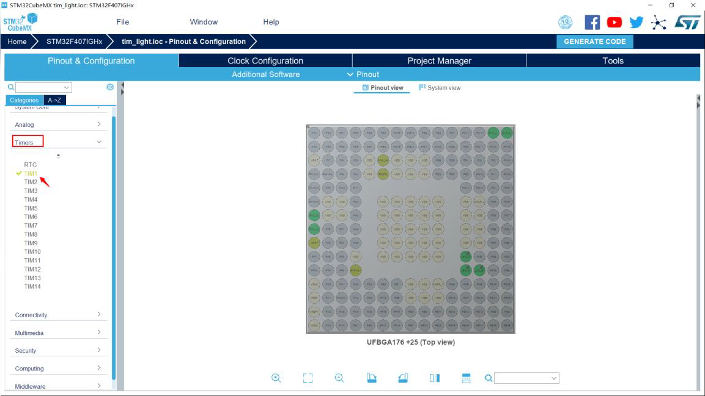
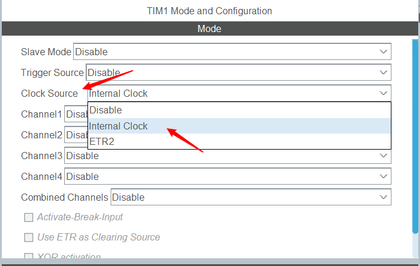
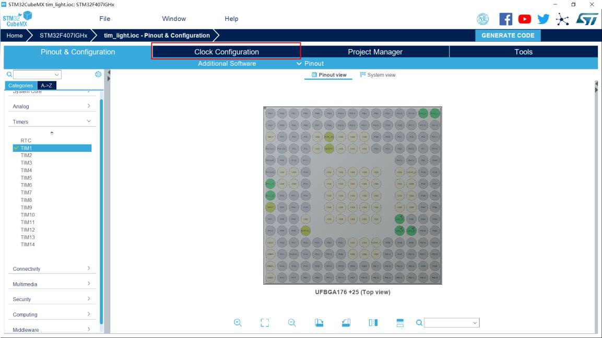
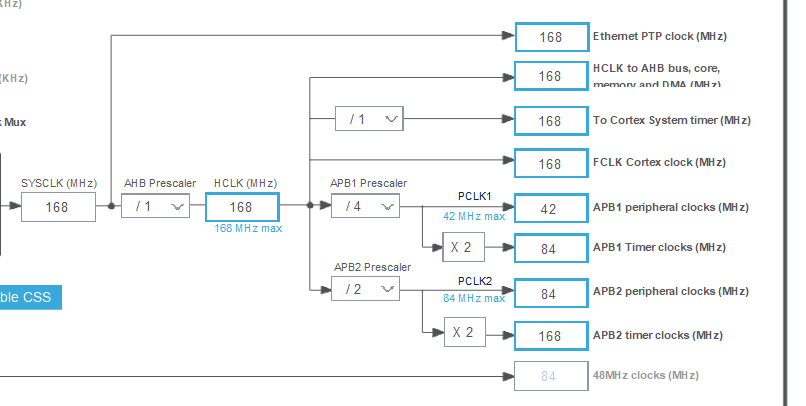
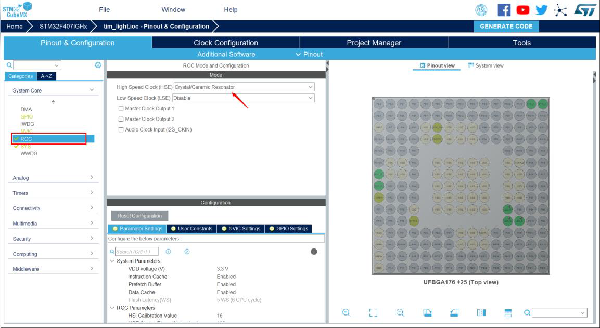
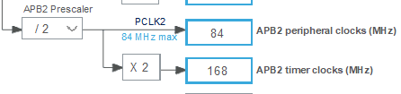
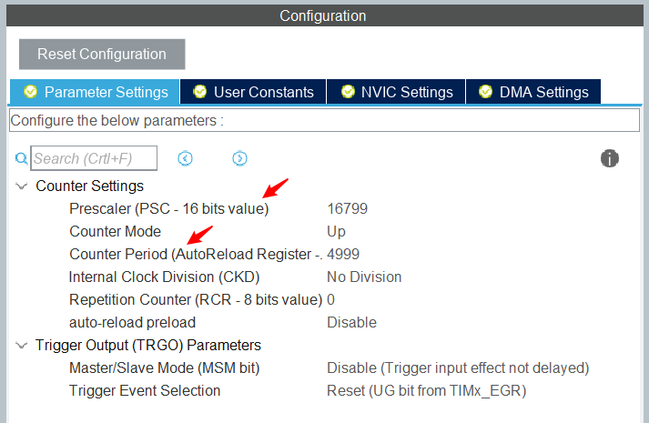
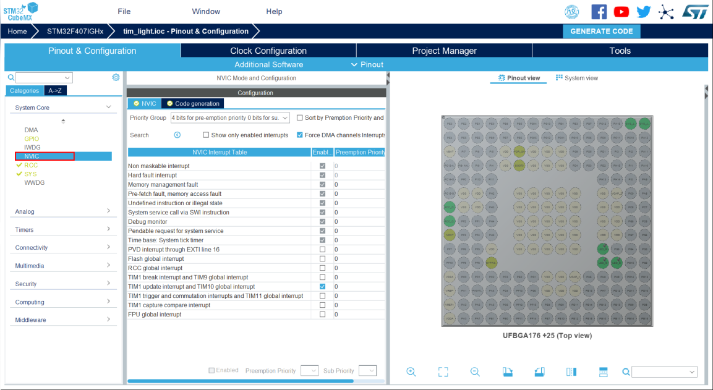
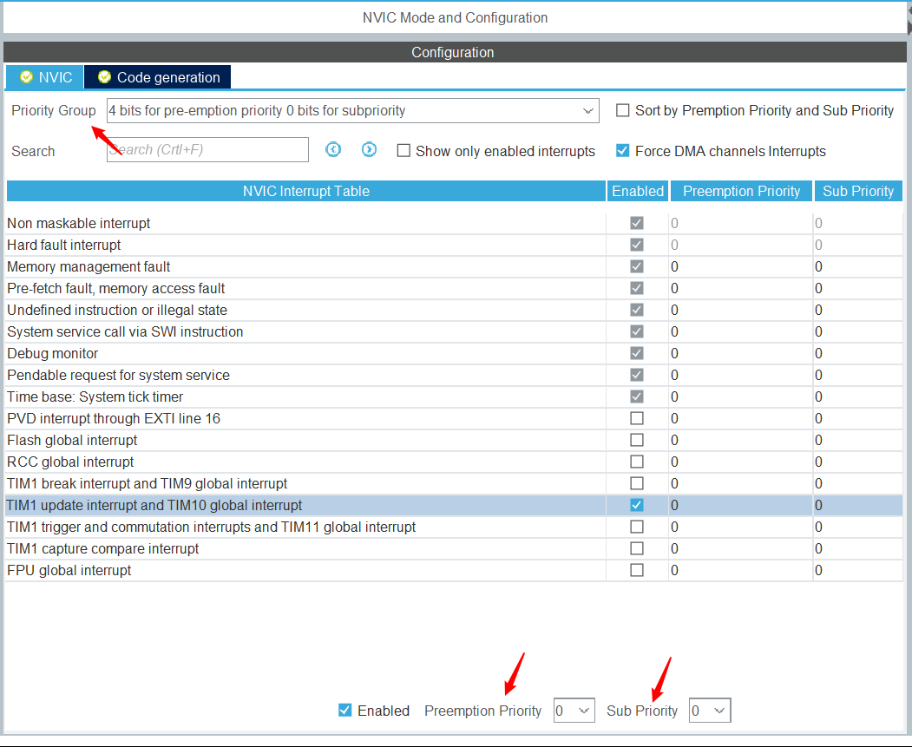

# Class 4 定时器的使用

[【嵌入式小白的学习之路】4. Ubuntu嵌入式开发-定时器](https://www.bilibili.com/video/BV1Gu4y1S7p3)

## 一、本次的目标

使用定时器中断使 LED 闪烁

## 二、原理简介

由于延时方法在等待延时的过程中没有执行任务，会对我们的 MCU 的资源造成浪费，毕竟有这个等待的时间我们本来可以做点别的事情的。所以我们可以选择定时器中断的方式来进行：

### 定时器的介绍

>定时器的基本功能是计时功能，如同闹铃一般，设定好对应的时间后，会在设定的时刻响起铃声。设定为 1ms 的定时时间，便每隔 1ms 引起中断函数。在使用定时器时，会涉及到三个非常重要的概念——分频，计数，重载。这三个概念可以结合生活中使用的时钟来理解。
>分频：时钟上不同的指针需要有不同的速度，也就是不同的频率，从而精确的表示时间，比如秒针，分针，时针，这三者相邻的频率之比都是 60:1，即秒针每转过 60 格分针转动 1 格，分针转动 60 格时针转动 1 格，所以分针对于秒针的分频为 60。
>计数：时钟所对应的值都是与工作时间成正比的，比如秒针转动 10 格，意味着过了 10 秒，同样定时器中的计数也是和计数时间成正比的值，频率越高增长速度越快。
>重载：时、分、秒的刻度都是有上限的，一个表盘最多记 12 小时，60 分钟，60 秒，如果继续增加的话就会回到 0。同样的在定时器中也需要重载，当定时器中的计数值达到重载值时，计数值就会被清零。
>现在介绍与定时器有关的三个重要寄存器：
>预分频寄存器 TIMx_PSC
>计数器寄存器 TIMx_CNT
>自动重装载寄存器 TIMx_ARR
>时钟源处的时钟信号经过预分频寄存器 TIMx_PSC，按照 TIMx_PSC内部的值进行分频。比如时钟源的频率为 16MHz，而预分频寄存器中设置的值为 16：1，那么通过预分频后进入定时器的时钟频率就下降到了 1MHz。
>在已经分频后的定时器时钟驱使下， TIMx_CNT 根据该时钟的频率向上计数，直到TIMx_CNT 的值增长到与设定的自动重装载寄存器 TIMx_ARR 相等时， TIMx_CNT 被清空，并重新从 0 开始向上计，TIMx_CNT 增长到TIMx_ARR 中的值后被清空时产生一个定时中断触发信号 。 综上定时器触发中断时间是由设定的 TIMx_PSC 中的分频比和TIMx_ARR 中的自动重装载值共同决定的。
>定时器是 stm32 中非常重要的外设。在大多数应用场景中，部分任务需要_周期性_的执行，比如之前提到的 LED 闪烁，这个功能就可以依靠定时器来实现，此外 stm32 的定时器还能够提供 PWM 输出，输入捕获，输出比较等多种功能。

## 三、手把手教实践

接下来我们一起来学着使用定时器中断，步骤如下： 步骤：这里完全参考 C 板教程

1. 在 cubeMX 中配置定时器 stm32 中断优先级理解，cubeMX 中的中断配置，中断函数管理
2. cubeMX 中的中断配置以及中断函数管理：
3. 定时器回调函数介绍
4. 定时器初始化函数调用 HAL_TIM_Base_Start 函数

### 在 cubeMX 中配置定时器

本章驱动 LED 的 GPIO 配置与前两章相同，此外还需要在 cubeMX 中设置定时器。操作如下：

1. 在左侧的标签页中选择 Timer，点击标签页下的 TIM1。


2. 在弹出的 TIM1 Mode and Configuration 中，在 ClockSouce 的右侧下拉菜单中选中 Internal Clock。


3. 此时 TIM1 得到使能，接下来需要配置 TIM1 的运转周期。需要打开 Clock Configuration 标签页。


下图为 STM32 的时钟树结构，通过配置这个结构中各处的分频/倍频比，可以控制最后输出到各个外设的时钟。


如果 HSE 处为灰色，则先去 Pinout&Configuration 标签页下确定是否使能外部晶振。


通过查阅数据手册资料，可以知道 TIM1 的时钟源来自 APB2 总线。

注意到在时钟树配置页面下的 APB2 Timer clocks（MHz）为 168MHz，这意味着提供给 TIM1 预分频寄存器的频率就是 168MHz。


下面通过设置分频比和重载值来控制定时器的周期。如果想要得到周期为 500 毫秒的定时器，则可以按照进阶学习介绍的公式来对分频值和重载值进行设定。

回到 Pinout&Configuration 标签页下，对应 TIMx_PSC 寄存器的 Prescaler 项和对应 TIMx_ARR 寄存器的 Counter Period 项。
500ms 对应的频率为 2Hz，为了得到 2Hz 的频率，可以将分频值设为 16799，重载值设为 4999，则可以计算出定时器触发频率为：

$$f = \frac { 16800000 I z } { ( 16799 + 1 ) * ( 4999 + 1 ) } = 2 H z$$



### cubeMX 中的中断配置以及中断函数管理

在 cubeMX 的 NVIC 标签页下可以看到当前系统中的中断配置



列表中显示了当前系统中所有中断的使能情况与优先级设置。要使能中断则在 Enable 一栏打勾，这里选中 TIM1 update interrupt，打勾，开启该中断。此外还可以在该页面下进行抢占优先级和响应优先级的分配和中断的两种优先级的配置。这里为定时器 1 的中断保持默认的 0，0 优先级。



点击 Generate code，生成代码。

下面来看一下 HAL 库是如何对中断进行处理的。

在 stm32f4xx_it.c 中，找到 cubeMX 自动生成的中断处理函数。void TIM1_UP_TIM10_IRQHandler(void)

它调用了 `void HAL_TIM_IRQHandler（TIM_HandleTypeDef *htim` 这一函数，该函数是 HAL 对涉及中断的寄存器进行处理（参数 `*htim` 定时器的句柄指针，如定时器 1 就输入`&htim1`，定时器 2 就输入`&htim2`）

在 HAL_TIM_IRQHandler 对各个涉及中断的寄存器进行了处理之后，会自动调用中断回调函数 HAL_TIM_PeriodElapsedCallback，该函数使用__weak 修饰符修饰，即用户可以在别处重新声明该函数，调用时将优先进入用户声明的函数。

```c
__weak void HAL_TIM_PeriodElapsedCallback(TIM_HandleTypeDef *htim)
```

一般我们需要在中断回调函数中判断中断来源并执行相应的用户操作。

### 定时器中断回调函数

如前文所介绍的，HAL 库在完成定时器的中断服务函数后会自动调用定时器回调函数。

通过配置 TIM1 的分频值和重载值，使得 TIM1 的中断以 500ms 的周期被触发。因此中断回调函数也是以 500ms 为周期被调用。在 main.c 中重新声明定时器回调函数，并编写内容如下：

```c
void HAL_TIM_PeriodElapsedCallback(TIM_HandleTypeDef *htim) 
{ 
    if(htim == &htim1) 
    { 
        //500ms trigger 
        bsp_led_toggle(); 
    } 
}
```

可以看到首先在回调函数中进行了中断来源的判断，判断其来源是否是定时器 1。如果有其他的定时器产生中断，同样会调用该定时器回调函数，因此需要进行来源的判断。

在确认了中断源为定时器 1 后，再调用 bsp_led_toggle 函数，翻转 LED 引脚的输出电平。

### 定时器开始工作的函数

如果不开启中断，仅让定时器以定时功能工作，为了使定时器开始工作，需要调用 HAL 库提供的函数。

```c
HAL_StatusTypeDef HAL_TIM_Base_Start(TIM_HandleTypeDef *htim)
```

如果需要使用定时中断，则需要调用函数 

```c
HAL_StatusTypeDef HAL_TIM_Base_Start_IT(TIM_HandleTypeDef *htim)
```

以上两个函数如果要使用则都需要在主循环 while（1）之前调用。二选一即可。
