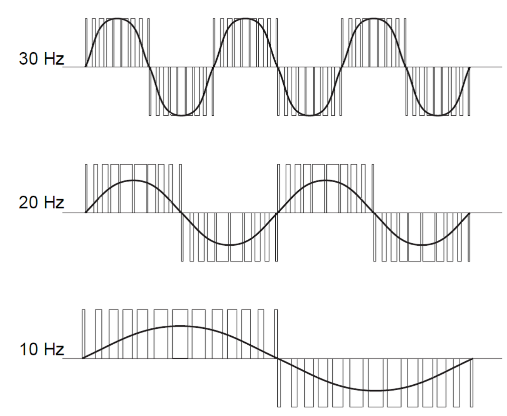
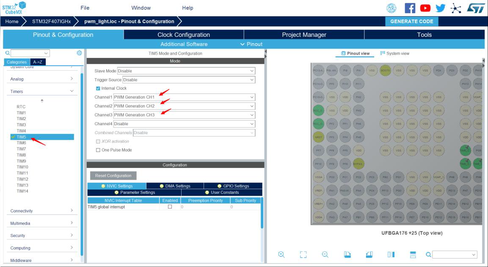
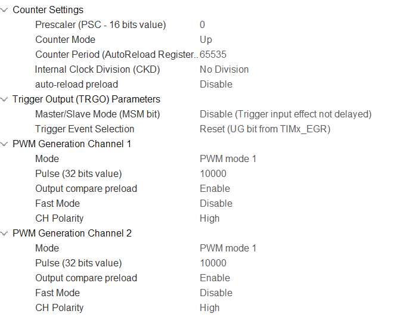
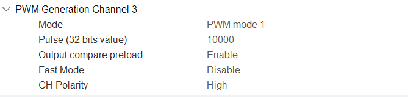
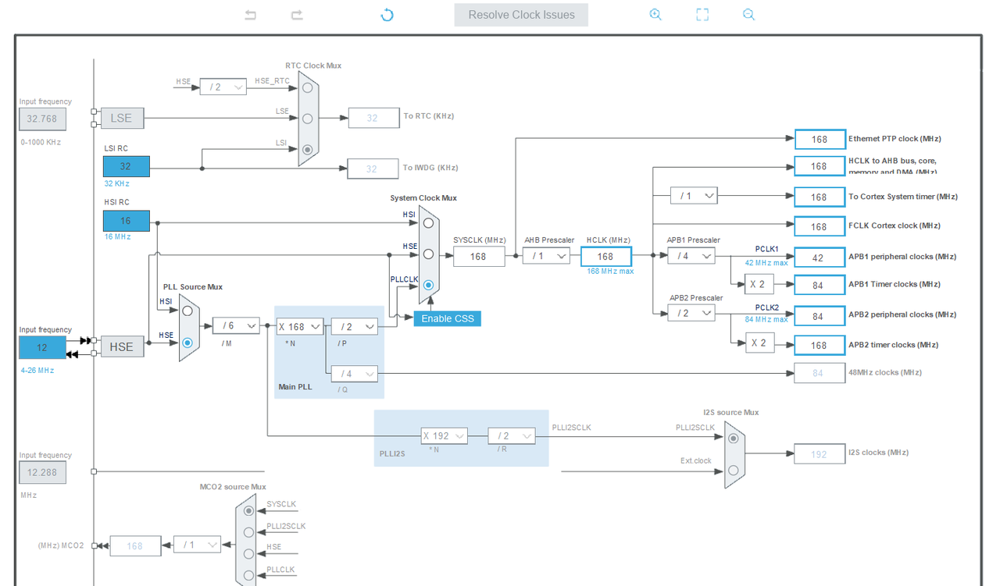
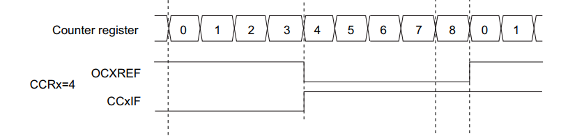

# Class 5 PWM

[【嵌入式小白的学习之路】5. Ubuntu嵌入式开发-PWM](https://www.bilibili.com/video/BV12h4y157sV)

## 一、本次的目标

使用PWM调节LED灯亮度，产生呼吸灯效

## 二、原理简介

PWM即脉冲宽度调制是英文“Pulse Width Modulation”的缩写，简称脉宽调制。是利用微处理器的数字输出来对模拟电路进行控制的一种非常有效的技术。广泛应用在从测量、通信到功率控制与变换的许多领域中。 在我们日常使用的手机上，OLED屏使用的就是PWM调光，简而言之，就是一会亮一会断。由于人眼知觉闪烁的极限频率60~220Hz不等，这个过程只要做的足够快（PWM频率够高），人眼便察觉不到图像的不连续。所以OLED屏幕有伤眼睛的传闻有了貌似科学的解释，这玩意相当于一个灯在你眼睛正前方狂闪，能不看坏眼睛吗（狗头），而使用直流电流控制背光亮度的LCD屏则被认为更加护眼。



例如上图中，矩形脉冲是stm32输出的数字信号，当这个信号接到外设上时，效果可以等效为这个正弦波。 一个周期内高电平的持续时间占总周期的比例成为占空比，通过修改占空比，可以改变输出的等效模拟电压。例如输出占空比为50%，频率为10Hz的脉冲，高电平为3.3V.则其输出的模拟效果相当于输出一个1.65V的高电平。此外PWM输出的频率也会影响最终的PWM输出效果，PWM输出的频率越高，最终输出的“连续性”越好，越接近模拟信号的效果，频率低则会增强离散性，最终的输出效果会有比较强的“突变”感。 脉冲调制有两个重要的参数，第一个就是输出频率，频率越高，则模拟的效果越好。第二个就是占空比。占空比就是改变输出模拟效果的电压大小。占空比越大则模拟出的电压越大。

## 三、手把手教实践


1. 配置PWM引脚与对应定时器，配置后我们可以在 **MX_TIM5_Init**(void)函数中看到定时器的变化
2. PWM配置与参数计算
3. 程序设计

### cubeMX配置定时器和PWM引脚

在cubeMX中设置定时器5的通道1，2，3为PWM输出。可以注意到三个通道对应的引脚正是之前的实验中使用的LED引脚。



定时器5如下配置，设置重载值为65535。





时钟树配置如下：



点击Generate Code，生成工程代码。

### PWM配置与参数计算

在上一节课中介绍了STM32的定时器，并提到PWM输出是STM32的定时器的功能之一，为了实现PWM功能，需要使用定时器中的比较寄存器（TIMx_CCRx）。

当定时器以PWM模式工作时，会自动将TIMx_CCRx的值与TIMx_CNT（计数寄存器）中的值做比较，当TIMx_CNT中的值小于TIMx_CCRx的值时，PWM输出引脚输出高电平，大于时则输出低电平。因此知道了PWM信号的周期和占空比可以通过设置比较寄存器TIMx_CCRx和定时器重载寄存器TIMx_ARR来控制。
PWM的占空比可以通过下图公式计算：

$$
P=\frac{T I M x_{C C R x}-1}{T I M x_{A R R}} * 100 \%
$$

以下图为例，该定时器的重载值为8，比较寄存器值为4，输出信号为OCXREF,则其占空比为44.4％。



一个定时器工作在PWM输出模式下时，有4个通道可以进行PWM信号的输出，每一个定时器都有对应标号的比较寄存器，比如5号定时器的1号通道对应的比较寄存器为TIM5_CCR1。

在程序中，我们可以通过修改比较寄存器TIMx_CCRx的值来控制PWM输出的占空比。

### 程序设计

为了使定时器开始PWM输出，除了要通过HAL_TIM_Base_Start使定时器开始工作，还需要在初始化时调用HAL库提供的PWM初始化函数HAL_TIM_PWM_Start。

```c
/* USER CODE BEGIN 2 */
HAL_TIM_PWM_Start(&htim5, TIM_CHANNEL_1);
/* USER CODE END 2 */
```

首先初始化定时器5和1通道的PWM输出后进入主循环。为了实现呼吸灯灯效，需要以合适的速度一点一点的修改PWM的占空比，这样灯的亮灭就会产生流畅的明暗渐变效果，也就是所谓的呼吸灯。这里我们直接使得pulse递增，最后将pulse赋值通过__HAL_TIM_SetCompare函数给对应的比较寄存器TIM5->CCRx，来控制LED的亮度。

```c
while (1)
{
    if(dir == 0){
        if(pulse >= 10000){
            dir = 1;
        }
        pulse = pulse + 20;
        __HAL_TIM_SET_COMPARE(&htim5, TIM_CHANNEL_1, pulse); 

    }
    if(dir == 1){
        pulse = pulse - 20;
        if(pulse <= 0){
            dir = 0;
        }
        __HAL_TIM_SET_COMPARE(&htim5, TIM_CHANNEL_1, pulse);
    }
    HAL_Delay(1);
}

/* USER CODE END 3 */
```

## 四、小小作业

1. 使用PWM驱动C板上的无源蜂鸣器 （可能会用到之前视频中提到的查询C板资料、配置IO口、以及PWM的使用）
2. 如果你有舵机的话，可以使用PWM驱动小舵机转动
3. 使用C板上的RGB LED使用aRGB模式合成想要的灯效（RoboMaster开发板C型嵌入式软件教程文档中有介绍）
