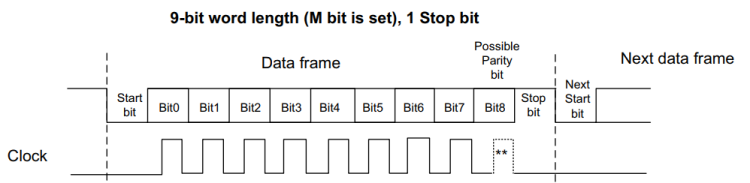
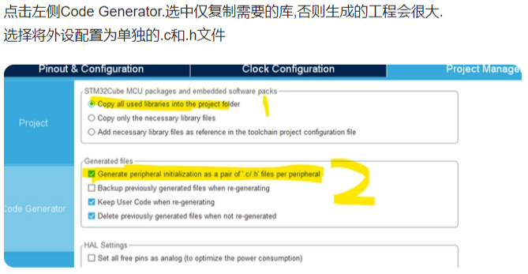
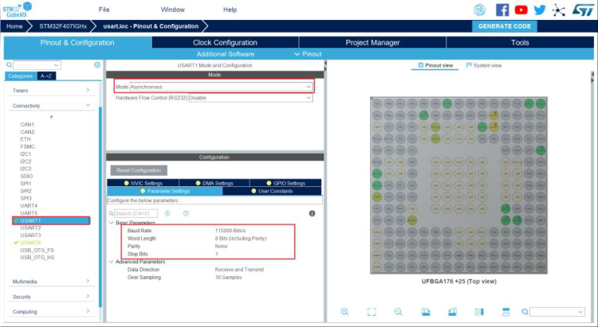
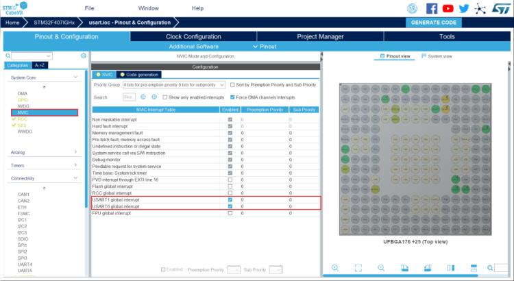
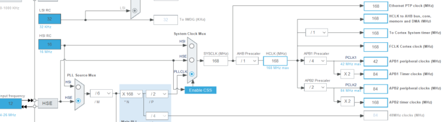
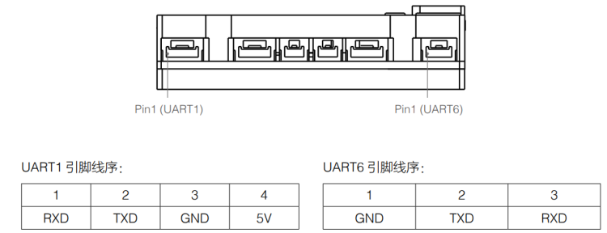

# Class 6 串口通信

[【嵌入式小白的学习之路】6.1 Ubuntu嵌入式开发-串口通信（一）](https://www.bilibili.com/video/BV1zm4y1L7XT)

[【嵌入式小白的学习之路】6.2 Ubuntu嵌入式开发-串口通信（二）](https://www.bilibili.com/video/BV1qN411Y7vG)


## 一、本次的目标
学会使用串口通信：

- 串口在cubeMX中的配置方法
- 串口的接收中断功能
- 串口的发送函数与发送中断

 使用电脑向C板串口发送Hello\r\n，C板将通过串口回发Hello World。

## 二、原理简介

串口全称为通用串行通信接口，是一种非常常用的通信接口。串行即以高低电平表示1和0，将数据一位一位顺序发送给接收方。通用串行通信接口有着协议简单，易于控制的优点。

串口的通讯协议由开始位，数据位，校验位，结束位构成。一般以一个低电平作为一帧数据的起始，接着跟随8位或者9位数据位，之后为校验位，分为奇校验，偶校验和无校验，最后以一个先高后低的脉冲表示结束位，长度可以设置为0.5，1，1.5或2位长度。

奇偶校验位的原理是统计发送数据中高电平即’1’的奇偶，将结果记录在奇偶校验位中发送给接收方，接收方收到奇偶校验位后和自己收到的数据进行对比，如果奇偶性一致就接受这帧数据，否则认为这帧数据出错。

下图是一个8位数据位，1位奇偶校验位，1位结束位的串口数据帧。



## 三、手把手教实践

但是我们使用串口，只需要调用一些HAL库的函数。

1. 串口在cubeMX中的配置
2. 串口的接收中断
3. 串口发送函数与中断函数

### 串口在cubeMX中的配置

从这一课开始我们需要添加自定义的头文件的.c文件了，需要再 cubeMX 中的第三页 Project Manager - Code Generator 中进行生成代码设置



串口在cubeMX中的配置过程如下：

4. 首先在Connectivity标签页下将USART6打开,将其Mode设置为Asynchronous异步通讯方式。异步通讯即发送方和接收方间不依靠同步时钟信号的通讯方式。
5. 接着将其波特率设置为115200，数据帧设置为8位数据位，无校验位，1位停止位。（默认）



6. 接着前往NVIC标签页下，开启USART6的中断。



工程时钟配置如图：



7. 点击Generate Code生成工程。

### 串口的接收中断

串口接收中断即每当串口完成一次接收之后触发一次中断。在STM32中相应的中断处理函数为USARTx_IRQHandler，中断回调函数为HAL_UART_RxCpltCallback。也可以通过USART状态寄存器中的UART_FLAG_RXNE位判断USART是否发生了接收中断。

### 串口发送函数与中断函数

HAL库提供了串口发送函数HAL_UART_Transmit，通过这个函数可以从指定的串口发送使能发送完成中断后，每当完成一次串口发送，串口会触发一次发送完成中断，对应的中断回调函数为HAL_UART_TxCpltCallback。


```c
HAL_StatusTypeDef HAL_UART_Transmit(UART_HandleTypeDef *huart, uint8_t *pData, uint16_t Size, uint32_t Timeout)
```

### 代码实现

首先在初始化时初始化串口6的接收中断，发生接收中断后，匹配串口接收内容与字符串“Hello”，在接收中断回调函数中在主循环中通过HAL_UART_Transmit函数完成串口6的数据发送，发送内容为“Hello World\r\n”这一字符串。

```c
/* USER CODE BEGIN 0 */
#include "stdio.h"
#include "string.h"

#define RXBUFFERSIZE  256     //最大接收字节数

string hello='Hello';
string wolrd = "Hello World\r\n";
char RxBuffer[RXBUFFERSIZE];  //接收数据
uint8_t aRxBuffer;                              //接收中断缓冲
uint8_t Uart1_Rx_Cnt = 0;     //接收缓冲计数
/* USER CODE END 0 */
```

```c
/* USER CODE BEGIN  */
void HAL_UART_RxCpltCallback(UART_HandleTypeDef *huart)
{ 
    if(Uart1_Rx_Cnt >= 255)  //溢出判断
    {
        Uart1_Rx_Cnt = 0;
        memset(RxBuffer,0x00,sizeof(RxBuffer));
        HAL_UART_Transmit(&huart6, (uint8_t *)"数据溢出", 10,0xFFFF);         
    }
    else
    {
        RxBuffer[Uart1_Rx_Cnt++] = aRxBuffer;   //
        if((RxBuffer[Uart1_Rx_Cnt-1] == 0x0A)&&(RxBuffer[Uart1_Rx_Cnt-2] == 0x0D)) //判断结束位
        {
            if(strstr(RxBuffer,hello)!=NULL)
                HAL_UART_Transmit(&huart1, (uint8_t *)wolrd, Uart1_Rx_Cnt,0xFFFF); //将收到的信息发送出去
            while(HAL_UART_GetState(&huart1) == HAL_UART_STATE_BUSY_TX);//检测UART发送结束
            Uart1_Rx_Cnt = 0;
            memset(RxBuffer,0x00,sizeof(RxBuffer)); //清空数组
        }
    }

    HAL_UART_Receive_IT(&huart6, (uint8_t *)&aRxBuffer, 1);   //因为接收中断使用了一次即关闭，所以在最后加入这行代码即可实现无限使用
}
/* USER CODE END  */
```

```c
/* USER CODE BEGIN 2 */
HAL_UART_Receive_IT(&huart6, (uint8_t *)&aRxBuffer, 1);
/* USER CODE end 2 */
```

DAP-Link上有串口，我们需要将其与我们的串口连接，即可进行调试。

USART6对应着C板海绵上的串口2，我们可以在用户手册中查询到有关信息。




注意串口引脚映射，可以在用户手册中查询到：


## 踩到的坑

1. 没有保存就make导致make的内容并没有更新
2. String类型是c++的，c语言里没有这种说法，在c中需要使用字符数组char[]来代替String
3. 括号遗漏等等笔误
4. 找串口：putty的Serial line端口配置问题不正确，寻找对应串口设备名称
5. “说不了话”：putty里面要对应设置，另外putty中需要设置SSH-Serial为flow control为none，terminal中勾选对应项。
6. 匹配不上，发送的字符串没有大写；putty发送字符串没有加上回车，字符串末尾的标识未匹配；另外putty中换行符为\r，而非常用的\n或\r\n 

    （我强烈建议大家使用 **vofa+** 之类的可视化调试助手，以上三个问题都可以避免，下一课会讲到它的使用）
7. 重新编译后要退出Debug重新运行才行。

## 四、小小作业

1. 使用电脑通过向单片机串口发送指令，可以返回此刻灯的颜色或切换灯的颜色。
