# Class 7 DT7遥控与串口DMA

[【嵌入式小白的学习之路】7.1 遥控和电机PID - DT7遥控的使用（一）](https://www.bilibili.com/video/BV1Su4y1y7ds)

[【嵌入式小白的学习之路】7.2 遥控和电机PID - DT7遥控的使用（二）](https://www.bilibili.com/video/BV1dj411z7uV)

## 一、今天的目标

移植DT7的驱动，成功接收遥控的数据，通过串口DMA发送到我们的设备

- 串口DMA
- DT7遥控驱动

## 二、原理解析

### 串口DMA原理

DMA 是在使用串口进行通讯时常用的一个功能，使用该功能能够完成串口和内存之间直接的数据传送，而不需要 CPU 进行控制，从而节约 CPU 的处理时间。

DMA 全称为 Direct Memory Access（直接存储器访问），当需要将外部设备发来的数据存储在存储器中时，如果不使用 DMA 方式则首先需要将外部设备数据先读入 CPU 中，再由CPU 将数据存储到存储器中，如果数据量很大的话，那么将会占用大量的 CPU 时间，而通过使用 DMA 控制器直接将外部设备数据送入存储器，不需要占用 CPU。

STM32 中的许多通信方式如 USART，SPI，IIC 都支持 DMA 方式进行数据的收发。

### DT7遥控原理

遥控器和 stm32 之间采用 DBUS 协议进行通讯。DBUS 通讯协议和串口类似，DBUS 的传输速率为 100k bit/s，数据长度为 8 位，奇偶校验位为偶校验，结束位 1 位。需要注意的是DBUS 使用的电平标准和串口是相反的，在 DBUS 协议中高电平表示 0，低电平表示 1，如果使用串口进行接收需要在接收电路上添加一个反相器。
使用 DBUS 接收遥控器的数据，一帧数据的长度为 18 字节，一共 144 位，根据遥控器的说明书可以查出各段数据的含义，从而进行数据拼接，完成遥控器的解码，如图所示。

## 三、一起实践

实践的代码参考的大疆C板开源例程，我们对这些代码进行相应的移植以及学习，日益精进！！！

首先开启 USART1 和 USART3 并进行配置，其中 USART1 开启串口的 DMA 发送，用于数据发送 PC 的串口工具，USART3 开启串口的 DMA 接收，用于遥控器数据的接收

### 1. CubeMX配置

配置如下：

串口1配置：

1. 在 Connectivity 标签页下将**USART1** 打开,将其 Mode 设置为 Asynchronous 异步通讯
方式。异步通讯即发送方和接收方间不依靠同步时钟信号的通讯方式。
2. 将其波特率设置为 115200，数据帧设置为 8 位数据位，无校验位，1 位停止位。（默认）
串口3配置：
3. 在 Connectivity 标签页下将 **USART3** 打开,将其 Mode 设置为 Asynchronous 异步通讯方式。
4. 将其波特率设置为 **100000**，数据帧设置为 8 位数据位，**偶**校验位，1 位停止位。
DR16接收机拥有一个防呆接口，我们直接插到DBUS上就可以啦。

DMA配置：

5. 接着分别开启 USART1 和 USART3 的 DMA 功能。点开 USART1 的设置页面，打开DMA Settings 的标签页，点击 Add。
6. 在弹出的新条目中，将 DMA Request 选为 USART1_TX，数据从存储器流向外设，Priority 选为 Very High。
7. 同样，在 USART3 下找到 DMA Settings 标签呀，在 USART3 中将 DMA Request 选为 USART3_RX，数据从外设流向存储器，Priority 选为 Very High。

### 2. printf 函数实现过程

利用 stdarg.h 下的 va_start 函数和 vsprintf 函数再配合串口的 DMA 发送功能来实现 C 语言中的 printf。通过以上函数的操作，将要发送的数据内容存储在 `tx_buf` 中，将要发送的数据长度存储在 len 变量中，接着将 tx_buf 的首地址和数据长度 len 传递给 *DMA 发送函数*，完成本次的 DMA 数据发送。

添加

```c
/* USER CODE BEGIN Includes */
#include <stdio.h>
#include <stdarg.h>
#include "string.h"
/* USER CODE END Includes */
```

我们f在main中的USER Code Begin 0添加

```c
/* USER CODE BEGIN 0 */
const RC_ctrl_t *local_rc_ctrl;

void usart_printf(const char *fmt,...)
{
    static uint8_t tx_buf[256] = {0};
    static va_list ap;
    static uint16_t len;
    va_start(ap, fmt);

    //return length of string 
    //返回字符串长度
    len = vsprintf((char *)tx_buf, fmt, ap);

    va_end(ap);

    usart1_tx_dma_enable(tx_buf, len);

}

/* USER CODE END 0 */
```

### 3. 串口的 DMA 接收与发送配置

我们需要创建bsp文件夹来存放我们的板上外设有关的驱动程序，另外创建App文件夹，放置有关的应用（例如遥控协议解析）。这是大疆c板例程里提供的一种代码结构，这样的代码会具有很强的可读性。

接下来我们会先完善

在main.c中添加：

```c
/* USER CODE BEGIN Includes */
#include "remote_control.h"
#include "bsp_usart.h"
/* USER CODE END Includes */
```

配置两个串口的dma：

首先是调试串口：

bsp_usart.h

```c
#ifndef BSP_USART_H
#define BSP_USART_H
#include "struct_typedef.h"

extern void usart1_tx_dma_init(void);
extern void usart1_tx_dma_enable(uint8_t *data, uint16_t len);
#endif
```

bsp_usart.c

在初始化时，使能 DMA串口接收和空闲中断，配置当外设数据到达之后的存储的缓冲区，每一帧 sbus 数据为 18 字节。

```c
#include "bsp_usart.h"
#include "main.h"

extern UART_HandleTypeDef huart1;
extern DMA_HandleTypeDef hdma_usart1_tx;
void usart1_tx_dma_init(void)
{
    //enable the DMA transfer for the receiver request
    //使能DMA串口接收
    SET_BIT(huart1.Instance->CR3, USART_CR3_DMAT);
}
void usart1_tx_dma_enable(uint8_t *data, uint16_t len)
{

    //disable DMA
    //失效DMA
    __HAL_DMA_DISABLE(&hdma_usart1_tx);
    while(hdma_usart1_tx.Instance->CR & DMA_SxCR_EN)
    {
        __HAL_DMA_DISABLE(&hdma_usart1_tx);
    }

    //clear flag
    //清除标志位
    __HAL_DMA_CLEAR_FLAG(&hdma_usart1_tx, DMA_HISR_TCIF7);
    __HAL_DMA_CLEAR_FLAG(&hdma_usart1_tx, DMA_HISR_HTIF7);

    //set data address
    //设置数据地址
    hdma_usart1_tx.Instance->M0AR = (uint32_t)(data);
    //set data length
    //设置数据长度
    hdma_usart1_tx.Instance->NDTR = len;

    //enable DMA
    //使能DMA
    __HAL_DMA_ENABLE(&hdma_usart1_tx);
}
```

bsp_rc.h

```c
#ifndef BSP_RC_H
#define BSP_RC_H
#include "struct_typedef.h"

extern void RC_init(uint8_t *rx1_buf, uint8_t *rx2_buf, uint16_t dma_buf_num);
#endif
```

bsp_rc.c

在初始化时，使能 DMA串口接收和空闲中断，配置当外设数据到达之后的存储的缓冲区，在这里开启了双缓冲区功能，每一帧 sbus 数据为 18 字节，而开启的双缓冲区总大小为 36 字节，这样可以避免 DMA传输越界。

```c
#include "bsp_rc.h"
#include "main.h"

extern UART_HandleTypeDef huart3;
extern DMA_HandleTypeDef hdma_usart3_rx;

void RC_init(uint8_t *rx1_buf, uint8_t *rx2_buf, uint16_t dma_buf_num)
{
    //enable the DMA transfer for the receiver request
    //使能DMA串口接收
    SET_BIT(huart3.Instance->CR3, USART_CR3_DMAR);

    //enalbe idle interrupt
    //使能空闲中断
    __HAL_UART_ENABLE_IT(&huart3, UART_IT_IDLE);

    //disable DMA
    //失效DMA
    __HAL_DMA_DISABLE(&hdma_usart3_rx);
    while(hdma_usart3_rx.Instance->CR & DMA_SxCR_EN)
    {
        __HAL_DMA_DISABLE(&hdma_usart3_rx);
    }

    hdma_usart3_rx.Instance->PAR = (uint32_t) & (USART3->DR);
    //memory buffer 1
    //内存缓冲区1
    hdma_usart3_rx.Instance->M0AR = (uint32_t)(rx1_buf);
    //memory buffer 2
    //内存缓冲区2
    hdma_usart3_rx.Instance->M1AR = (uint32_t)(rx2_buf);
    //data length
    //数据长度
    hdma_usart3_rx.Instance->NDTR = dma_buf_num;
    //enable double memory buffer
    //使能双缓冲区
    SET_BIT(hdma_usart3_rx.Instance->CR, DMA_SxCR_DBM);

    //enable DMA
    //使能DMA
    __HAL_DMA_ENABLE(&hdma_usart3_rx);

}
```

### 4. 遥控

remote.h

```c

#ifndef REMOTE_CONTROL_H
#define REMOTE_CONTROL_H
#include "struct_typedef.h"
#include "bsp_rc.h"

#define SBUS_RX_BUF_NUM 36u

#define RC_FRAME_LENGTH 18u

#define RC_CH_VALUE_MIN         ((uint16_t)364)
#define RC_CH_VALUE_OFFSET      ((uint16_t)1024)
#define RC_CH_VALUE_MAX         ((uint16_t)1684)

/* ----------------------- RC Switch Definition----------------------------- */
#define RC_SW_UP                ((uint16_t)1)
#define RC_SW_MID               ((uint16_t)3)
#define RC_SW_DOWN              ((uint16_t)2)
#define switch_is_down(s)       (s == RC_SW_DOWN)
#define switch_is_mid(s)        (s == RC_SW_MID)
#define switch_is_up(s)         (s == RC_SW_UP)
/* ----------------------- PC Key Definition-------------------------------- */
#define KEY_PRESSED_OFFSET_W            ((uint16_t)1 << 0)
#define KEY_PRESSED_OFFSET_S            ((uint16_t)1 << 1)
#define KEY_PRESSED_OFFSET_A            ((uint16_t)1 << 2)
#define KEY_PRESSED_OFFSET_D            ((uint16_t)1 << 3)
#define KEY_PRESSED_OFFSET_SHIFT        ((uint16_t)1 << 4)
#define KEY_PRESSED_OFFSET_CTRL         ((uint16_t)1 << 5)
#define KEY_PRESSED_OFFSET_Q            ((uint16_t)1 << 6)
#define KEY_PRESSED_OFFSET_E            ((uint16_t)1 << 7)
#define KEY_PRESSED_OFFSET_R            ((uint16_t)1 << 8)
#define KEY_PRESSED_OFFSET_F            ((uint16_t)1 << 9)
#define KEY_PRESSED_OFFSET_G            ((uint16_t)1 << 10)
#define KEY_PRESSED_OFFSET_Z            ((uint16_t)1 << 11)
#define KEY_PRESSED_OFFSET_X            ((uint16_t)1 << 12)
#define KEY_PRESSED_OFFSET_C            ((uint16_t)1 << 13)
#define KEY_PRESSED_OFFSET_V            ((uint16_t)1 << 14)
#define KEY_PRESSED_OFFSET_B            ((uint16_t)1 << 15)
/* ----------------------- Data Struct ------------------------------------- */
typedef __packed struct
{
        __packed struct
        {
                int16_t ch[5];
                char s[2];
        } rc;
        __packed struct
        {
                int16_t x;
                int16_t y;
                int16_t z;
                uint8_t press_l;
                uint8_t press_r;
        } mouse;
        __packed struct
        {
                uint16_t v;
        } key;

} RC_ctrl_t;

/* ----------------------- Internal Data ----------------------------------- */

/**
  * @brief          遥控器初始化
  * @param[in]      none
  * @retval         none
  */
extern void remote_control_init(void);
/**
  * @brief          获取遥控器数据指针
  * @param[in]      none
  * @retval         遥控器数据指针
  */
extern const RC_ctrl_t *get_remote_control_point(void);

#endif
```

remote.c

***remote_control_init***：

通过函数 remote_control_init 进行 USART3 的 DMA 接收的初始化，里面直接调用了RC_init

*USART3_IRQHandler*:

在完成初始化之后，每当 USART3 产生空闲中断时就会进入 USART3_IRQHandler 进行处理，在 USART3_IRQHandler 中，进行寄存器中断标志位的处理，然后判断进行接收的缓冲区是 1 号缓冲区还是 2 号缓冲区，使用设定长度减去剩余长度，获取本次 DMA 得到的数据的长度，判断是否与一帧数据（18 字节）长度相等，如果相等则调用函数 sbus_to_rc 进行遥控器数据的解码。

*sbus_to_rc*：

遥控器数据处理函数 sbus_to_rc 的功能是将通过 DMA 获取到的原始数据，按照遥控器的数据协议拼接成完整的遥控器数据，以通道 0 的数据为例，从遥控器的用户手册中查到通道0的长度为 11bit，偏移为 0。

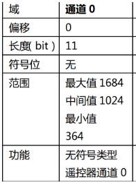

这说明如果想要获取通道 0 的数据就需要将第一帧的 8bit 数据和第二帧数据的后三 bit 数据拼接，如果想要获取通道 1 的数据就将第二帧数据的前 5bit 和第三帧数据的后 6bit 数据进行拼接，不断通过拼接就可以获得所有数据帧，拼接过程的示意图如下：

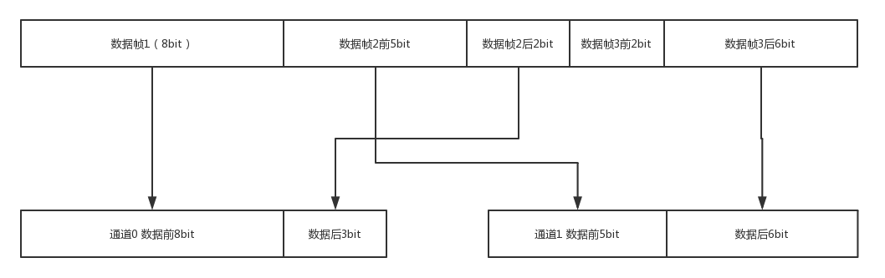

解码函数 sbus_to_rc 通过位运算的方式完成上述的数据拼接工作，十六进制数 0x07ff 的二进制是 0b0000 0111 1111 1111，也就是 11 位的 1，和 0x07ff 进行与运算相当于截取出 11位的数据。

通道 0 的数据获取：首先将数据帧 1 和左移 8 位的数据帧 2 进行或运算，拼接出 16 位的数据，前 8 位为数据帧 2，后 8 位为数据帧 1，再将其和 0x07ff 相与，截取 11 位，就获得了由数据帧 2 后 3 位和数据帧 1 拼接成的通道 0 数据。其过程示意图如下：

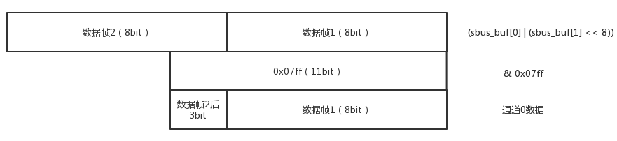

通过上述方式就可以获取遥控器各个通道和开关，以及键鼠的数据值。

```c
/**
  ****************************(C) COPYRIGHT 2019 DJI****************************
  * @file       remote_control.c/h
  * @brief      遥控器处理，遥控器是通过类似SBUS的协议传输，利用DMA传输方式节约CPU
  *             资源，利用串口空闲中断来拉起处理函数，同时提供一些掉线重启DMA，串口
  *             的方式保证热插拔的稳定性。
  * @note       该任务是通过串口中断启动，不是freeRTOS任务
  ****************************(C) COPYRIGHT 2019 DJI****************************
  */

#include "remote_control.h"

#include "main.h"

extern UART_HandleTypeDef huart3;
extern DMA_HandleTypeDef hdma_usart3_rx;

/**
  * @brief          遥控器协议解析
  * @param[in]      sbus_buf: 原生数据指针
  * @param[out]     rc_ctrl: 遥控器数据指
  * @retval         none
  */
static void sbus_to_rc(volatile const uint8_t *sbus_buf, RC_ctrl_t *rc_ctrl);

//remote control data 
//遥控器控制变量
RC_ctrl_t rc_ctrl;

//receive data, 18 bytes one frame, but set 36 bytes 
//接收原始数据，为18个字节，给了36个字节长度，防止DMA传输越界
static uint8_t sbus_rx_buf[2][SBUS_RX_BUF_NUM];

/**
  * @brief          遥控器初始化
  * @param[in]      none
  * @retval         none
  */
void remote_control_init(void)
{
    RC_init(sbus_rx_buf[0], sbus_rx_buf[1], SBUS_RX_BUF_NUM);
}

/**
  * @brief          获取遥控器数据指针
  * @param[in]      none
  * @retval         遥控器数据指针
  */
const RC_ctrl_t *get_remote_control_point(void)
{
    return &rc_ctrl;
}

//串口中断
void USART3_IRQHandler(void)
{
    if(huart3.Instance->SR & UART_FLAG_RXNE)//接收到数据
    {
        __HAL_UART_CLEAR_PEFLAG(&huart3);
    }
    else if(USART3->SR & UART_FLAG_IDLE)
    {
        static uint16_t this_time_rx_len = 0;

        __HAL_UART_CLEAR_PEFLAG(&huart3);

        if ((hdma_usart3_rx.Instance->CR & DMA_SxCR_CT) == RESET)
        {
            /* Current memory buffer used is Memory 0 */
    
            //disable DMA
            //失效DMA
            __HAL_DMA_DISABLE(&hdma_usart3_rx);

            //get receive data length, length = set_data_length - remain_length
            //获取接收数据长度,长度 = 设定长度 - 剩余长度
            this_time_rx_len = SBUS_RX_BUF_NUM - hdma_usart3_rx.Instance->NDTR;

            //reset set_data_lenght
            //重新设定数据长度
            hdma_usart3_rx.Instance->NDTR = SBUS_RX_BUF_NUM;

            //set memory buffer 1
            //设定缓冲区1
            hdma_usart3_rx.Instance->CR |= DMA_SxCR_CT;
            
            //enable DMA
            //使能DMA
            __HAL_DMA_ENABLE(&hdma_usart3_rx);

            if(this_time_rx_len == RC_FRAME_LENGTH)
            {
                sbus_to_rc(sbus_rx_buf[0], &rc_ctrl);
            }
        }
        else
        {
            /* Current memory buffer used is Memory 1 */
            //disable DMA
            //失效DMA
            __HAL_DMA_DISABLE(&hdma_usart3_rx);

            //get receive data length, length = set_data_length - remain_length
            //获取接收数据长度,长度 = 设定长度 - 剩余长度
            this_time_rx_len = SBUS_RX_BUF_NUM - hdma_usart3_rx.Instance->NDTR;

            //reset set_data_lenght
            //重新设定数据长度
            hdma_usart3_rx.Instance->NDTR = SBUS_RX_BUF_NUM;

            //set memory buffer 0
            //设定缓冲区0
            DMA1_Stream1->CR &= ~(DMA_SxCR_CT);
            
            //enable DMA
            //使能DMA
            __HAL_DMA_ENABLE(&hdma_usart3_rx);

            if(this_time_rx_len == RC_FRAME_LENGTH)
            {
                //处理遥控器数据
                sbus_to_rc(sbus_rx_buf[1], &rc_ctrl);
            }
        }
    }
}


/**
  * @brief          遥控器协议解析
  * @param[in]      sbus_buf: 原生数据指针
  * @param[out]     rc_ctrl: 遥控器数据指针
  * @retval         none
  */
static void sbus_to_rc(volatile const uint8_t *sbus_buf, RC_ctrl_t *rc_ctrl)
{
    if (sbus_buf == NULL || rc_ctrl == NULL)
    {
        return;
    }

    rc_ctrl->rc.ch[0] = (sbus_buf[0] | (sbus_buf[1] << 8)) & 0x07ff;        //!< Channel 0
    rc_ctrl->rc.ch[1] = ((sbus_buf[1] >> 3) | (sbus_buf[2] << 5)) & 0x07ff; //!< Channel 1
    rc_ctrl->rc.ch[2] = ((sbus_buf[2] >> 6) | (sbus_buf[3] << 2) |          //!< Channel 2
                         (sbus_buf[4] << 10)) &0x07ff;
    rc_ctrl->rc.ch[3] = ((sbus_buf[4] >> 1) | (sbus_buf[5] << 7)) & 0x07ff; //!< Channel 3
    rc_ctrl->rc.s[0] = ((sbus_buf[5] >> 4) & 0x0003);                  //!< Switch left
    rc_ctrl->rc.s[1] = ((sbus_buf[5] >> 4) & 0x000C) >> 2;                       //!< Switch right
    rc_ctrl->mouse.x = sbus_buf[6] | (sbus_buf[7] << 8);                    //!< Mouse X axis
    rc_ctrl->mouse.y = sbus_buf[8] | (sbus_buf[9] << 8);                    //!< Mouse Y axis
    rc_ctrl->mouse.z = sbus_buf[10] | (sbus_buf[11] << 8);                  //!< Mouse Z axis
    rc_ctrl->mouse.press_l = sbus_buf[12];                                  //!< Mouse Left Is Press ?
    rc_ctrl->mouse.press_r = sbus_buf[13];                                  //!< Mouse Right Is Press ?
    rc_ctrl->key.v = sbus_buf[14] | (sbus_buf[15] << 8);                    //!< KeyBoard value
    rc_ctrl->rc.ch[4] = sbus_buf[16] | (sbus_buf[17] << 8);                 //NULL

    rc_ctrl->rc.ch[0] -= RC_CH_VALUE_OFFSET;
    rc_ctrl->rc.ch[1] -= RC_CH_VALUE_OFFSET;
    rc_ctrl->rc.ch[2] -= RC_CH_VALUE_OFFSET;
    rc_ctrl->rc.ch[3] -= RC_CH_VALUE_OFFSET;
    rc_ctrl->rc.ch[4] -= RC_CH_VALUE_OFFSET;
}
```

接着使用 USART1 用 DMA 方式进行发送，将接收到的遥控器数据发送出来。
main.c中：
初始化工作：首先通过usart1_tx_dma_init 函数进行 dma 发送的初始化。
```c
  /* USER CODE BEGIN 2 */
    remote_control_init();
    usart1_tx_dma_init();
    local_rc_ctrl = get_remote_control_point();
  /* USER CODE END 2 */
```

在主循环中：调用 usart_print 函数，将解码完成的遥控器数据从 USART1 使用 DMA 方式发送出来。

```c
/* USER CODE BEGIN WHILE */
  while (1)
  {
    /* USER CODE END WHILE */

    /* USER CODE BEGIN 3 */
        usart_printf(
"**********\r\n\
ch0:%d\r\n\
ch1:%d\r\n\
ch2:%d\r\n\
ch3:%d\r\n\
ch4:%d\r\n\
s1:%d\r\n\
s2:%d\r\n\
mouse_x:%d\r\n\
mouse_y:%d\r\n\
press_l:%d\r\n\
press_r:%d\r\n\
key:%d\r\n\
**********\r\n",
            local_rc_ctrl->rc.ch[0], local_rc_ctrl->rc.ch[1], local_rc_ctrl->rc.ch[2], local_rc_ctrl->rc.ch[3], local_rc_ctrl->rc.ch[4],
            local_rc_ctrl->rc.s[0], local_rc_ctrl->rc.s[1],
            local_rc_ctrl->mouse.x, local_rc_ctrl->mouse.y,local_rc_ctrl->mouse.z, local_rc_ctrl->mouse.press_l, local_rc_ctrl->mouse.press_r,
            local_rc_ctrl->key.v);

        HAL_Delay(1000);
  }
  /* USER CODE END 3 */
```

另外我们还需要 BSP/struct_typedef.h

```c
#ifndef STRUCT_TYPEDEF_H
#define STRUCT_TYPEDEF_H

typedef signed char int8_t;
typedef signed short int int16_t;
typedef signed long long int64_t;

/* exact-width unsigned integer types */
typedef unsigned char uint8_t;
typedef unsigned short int uint16_t;
typedef unsigned long long uint64_t;
typedef unsigned char bool_t;
typedef float fp32;
typedef double fp64;

#endif
```

### 5. Makefile 修改

Makefile的大部分内容在CubeMX初始化的时候就会帮你生成。如果新增了.c的源文件，你需要在C_SOURCES中新增：

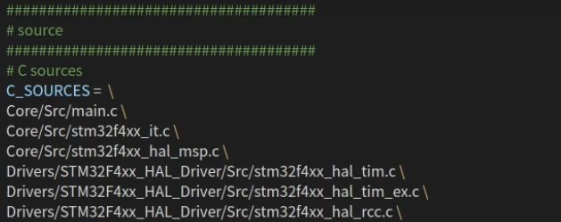


换行需要在行尾加空格反斜杠\

如果新增了头文件，在C_INCLUDES中新增头文件所在的文件夹：

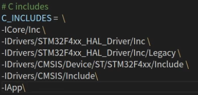

换行需要在行尾加空格反斜杠\

然后再进行make

#### __packed关键字的编译问题

typedef __packed struct 是字节对齐：

__packed关键字的意思是在struct和union结构中不添加填充字节

解决方案

https://social.msdn.microsoft.com/Forums/vstudio/en-US/8d04cb63-6c31-4057-935e-c5baf4dba217/typedef-packed-struct?forum=vclanguage

remote_control.h

```c
#define __packed  
#pragma pack(1) 
```

### 6. 串口连接与调试

用户手册可以查询线序：

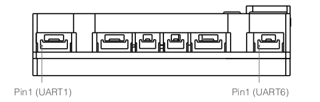

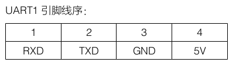

推荐使用vofa+进行调试 https://www.vofa.plus/downloads/ ，下载.deb安装包，直接安装。

### 7. 遇到的坑

#### 7.1 坑：串口引脚映射问题

打开串口后，cubeMX自动生成的引脚是以下这俩：

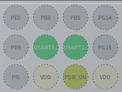

用户手册没有告诉其实他们用的不是默认的引脚映射，但我们从原理图可以查询到：

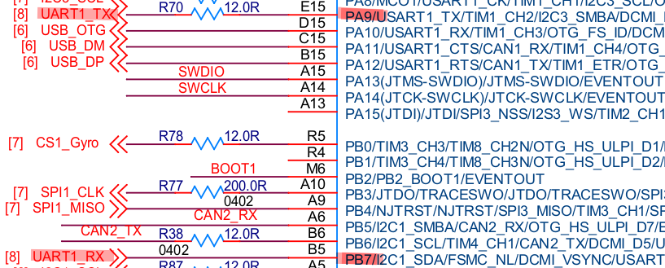

这会导致我们串口通信的失败（废话引脚都对不上）

#### 7.2 坑：cubeMX配置

开启串口13的中断，另外进行中断配置

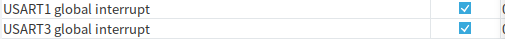

取消生成USART3中断的代码，因为我们前面自己写了一个。如果不取消会报错multiple defination

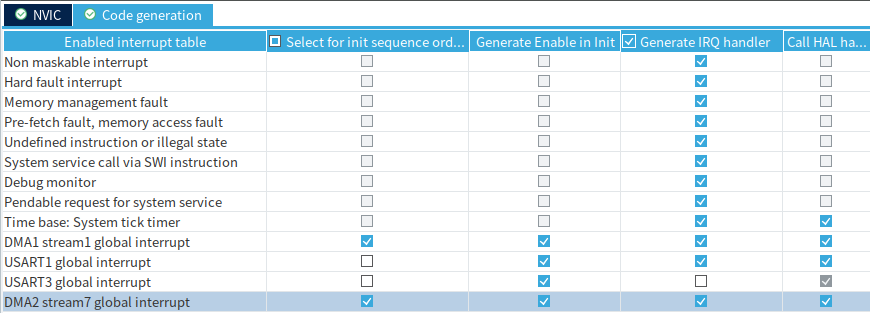

#### 7.3 坑：NDTR寄存器赋值造成崩溃

注释掉这一段，因为这段赋值会引发系统崩溃。

```c
//reset set_data_lenght
//重新设定数据长度
//hdma_usart3_rx.Instance->NDTR = SBUS_RX_BUF_NUM;
```

查询STM32F407的手册，我们可以找到关于DMA中断的描述

每个DMA通道都可以在DMA传输过半、传输完成和传输错误时产生中断。为应用的灵活性考虑，通过设置寄存器的不同位来打开这些中断。

对于每个DMA数据流通道，可以在以下事件上产生中断：

- 达到半转移
- 转移完成
- 传输错误
- FIFO错误（溢出，欠载或FIFO内存错误）
- 直接模式错误

我们在前面设置的DMA为总大小36字节的双缓冲区，一帧sbus的大小为18字节，达到半转移/转移完成时都将触发中断，匹配上this_time_rx_len 后接下来在中断中会解析遥控器数据。

目前这种处理方法并没有遇到其它问题，也欢迎大家一起讨论s。

#### 7.4 坑：应该直接使用HAL库函数

不移植c板源码中的bsp_usart.c/.h，直接使用HAL库函数。

替换为：

```c
/* USER CODE BEGIN 0 */
const RC_ctrl_t *local_rc_ctrl;

void usart_printf(const char *fmt,...)
{
    static uint8_t tx_buf[256] = {0};
    static va_list ap;
    static uint16_t len;
    va_start(ap, fmt);

    //return length of string 
    //返回字符串长度
    len = vsprintf((char *)tx_buf, fmt, ap);

    va_end(ap);

    HAL_UART_Transmit_DMA(&huart1, tx_buf, len);

}

/* USER CODE END 0 */
```

有HAL库函数直接实现的，可以直接调用的时候我们直接使用HAL库函数，一些涉及较为底层的操作的内容可能会随着HAL库的版本更新不再兼容。

#### 7.5 坑：遥控器拨轮校准

串口输出的拨轮值非常奇怪，并且只有拨轮接收到的数据出现问题。可以初步排除代码解析遥控数据的问题。

我们尝试安装一下校准一下我们的DT7遥控器，先安装遥控器驱动，再安装调参软件：

>参考博客：https://blog.csdn.net/zhang1079528541/article/details/116784551
>
>遥控器驱动以及调参软件安装：
>https://www.robomaster.com/zh-CN/products/components/detail/122
>
>遥控器驱动安装时可能会提示安装不了，这时候请参考文章
>https://blog.csdn.net/zhang1079528541/article/details/116784551
>
>遥控器驱动下载：
>https://rm-static.djicdn.com/tem/RoboMaster%20%E9%81%A5%E6%8E%A7%E5%99%A8%E9%A9%B1%E5%8A%A8.7z
>
>要使用调参软件还需要把 ==图传接收机驱动== 安装好。
>图传接收机驱动下载：
>https://rm-static.djicdn.com/tem/17348/DJI%20Phantom%204%20Drivers_1.2_Installer%20%281%29.exe
>
>校准后拨轮输出值恢复正常。
