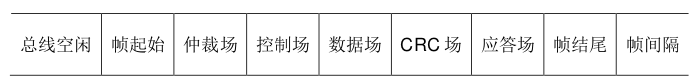
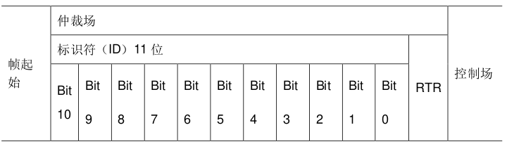
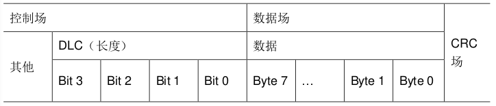
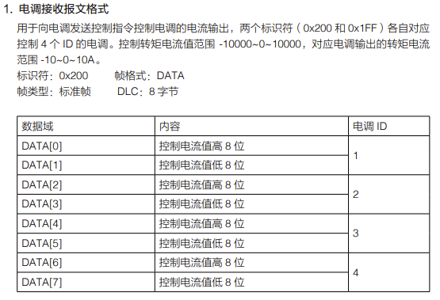
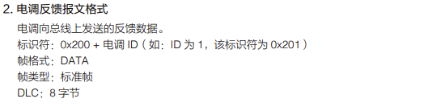
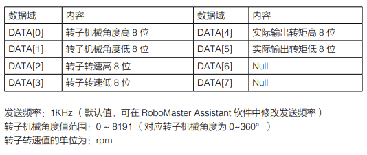
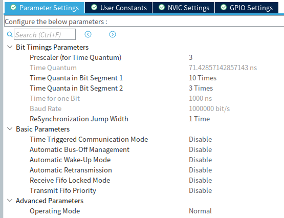
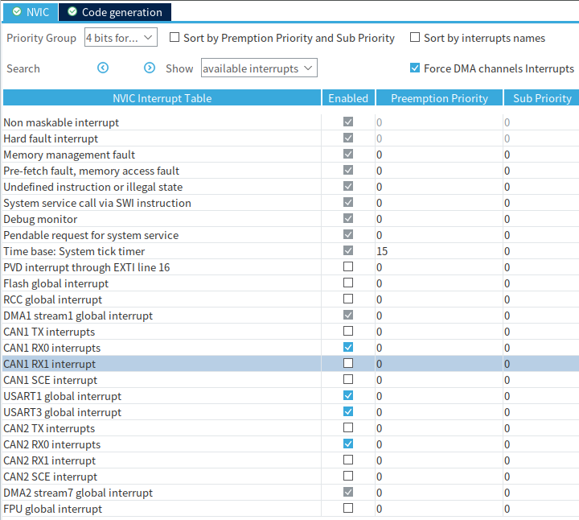

# Class 8 CAN通信和电机的使用

[【嵌入式小白的学习之路】8.1 CAN通信和电机的使用](https://www.bilibili.com/video/BV1xP411s7ua)

[【嵌入式小白的学习之路】8.2 CAN通信和电机的使用（二）](https://www.bilibili.com/video/BV1G8411X7eL/)

## 一、今天的目标

使用CAN通信让我们的电机转起来，并且使用CAN读取我们的电机工作数据

- CAN通信
- 电机驱动原理

我们今天使用的是一个2006电机，我们常用的3508电机也是类似的使用方法。

## 二、原理解析

### CAN通信

CAN 通讯是一种常见的现场总线通信方式，RoboMaster 大部分电机均是使用 CAN 通信进行控制的。

RoboMaster 系列电机也采用 CAN 协议进行通信，CAN 协议比较复杂，一个完整的数据帧由下图中的各个部分组成：



这里重点介绍 CAN 的 ==仲裁场== 和 ==数据场== 的内容。

和 I2C 总线一样，每一个挂载在 CAN 总线上的 CAN 都有一个自己独属的 ID，每当一个设备发送一帧数据时，总线其他设备会检查这个 ID 是否是自己需要接收数据的对象，如果是则接收本帧数据，如果不是则忽略。



ID 存储在数据帧最前头的仲裁场内，CAN 的 ID 分为标准 ID 和拓展 ID 两类，标准 ID 长度为 11 位。如果设备过多，标准 ID 不够用的情况下，可以使用拓展 ID，拓展 ID 的长度有 29位。

在通过 ID 判断本帧数据可以接收后，控制场中的 DLC 规定了本帧数据的长度，而数据场内的数据的大小为 8 Byte，即 8 个 8 位数据。CAN 总线的一个数据帧中所需要传输的有效数据实际上就是这 8Byte。



### RM 电机使用

使用RM电机主要参考官网发布的使用说明来进行，这里也有我们的

[M2006电机和C610电调使用说明](https://www.robomaster.com/zh-CN/products/components/general/M2006)

#### 电调接收

这是电调接收报文格式，以 1 到 4 号电调为例：如果要发送数据给 1 号到 4 号电调，控制电机的输出电流，从而控制电机转速时，需要按照表中的内容，将发送的 CAN 数据帧的 ID 设置为 0x200，数据域中的 8Byte 数据按照电调 1 到 4 的高八位和第八位的顺序装填，帧格式和 DLC 也按照表中内容进行设置，最后进行数据的发送。



#### 电调发送

而当要接收电调发送来的数据时，则按照下表进行：





首先根据接收到的 ID 判断究竟接收到的是哪个电调发送来的数据，手册中规定 1 号电调 ID为 0x201，2 号为 0x202，3 号为 0x203，4 号为 0x204。判断完数据来源之后，就可以按照手册中的数据格式进行解码，通过高八位和第八位拼接的方式，得到电机的转子机械角度，转子转速，转矩电流，电机温度（2006的电调无法读电机温度，其 DATA[6] 与 DATA[7] 为 Null ）等数据。


## 三、一起实践

### cubeMX配置

本小节将介绍 CAN 在 cubeMX 中的波特率的计算方法。

1. 首先在 cubeMX 中将 CAN1 开启，打开 Connectivity 下的 CAN1，进行 CAN1 的配置。
2. 在 Mode 中，将 Master Mode 选中打勾。  在 Configuration 界面中，需要进行 CAN 的波特率的配置，设置完分频系数 (Prescaler) 后，cubeMX 会自动完成 Time Quantum（简写为 tq）的计算，将 tq 乘以 tBS1 (Time Quanta in Bit Segment 1)，tBS2 (Time Quanta in Bit Segment 1)，RJW (ReSynchronization Jump Width) 之和刚好为 1 微秒，对应波特率为 1M，这是 CAN 总线支持的最高通讯速率。



3. CAN2操作类似
4. 启用CAN的RX0中断




### CAN 发送函数介绍

本小节将介绍 CAN 的发送函数。

大疆C板例程的 CAN_recieve.c 中，提供了 CAN_cmd_chassis 函数和CAN_cmd_gimbal 函数，用于向底盘电机和云台电机发送 CAN 信号，控制电机运动。

这是对3508电机进行ID设置的函数。

```c
/**
  * @brief          发送ID为0x700的CAN包,它会设置3508电机进入快速设置ID
  * @param[in]      none
  * @retval         none
  */
void CAN_cmd_chassis_reset_ID(void)
{
    uint32_t send_mail_box;
    chassis_tx_message.StdId = 0x700;
    chassis_tx_message.IDE = CAN_ID_STD;
    chassis_tx_message.RTR = CAN_RTR_DATA;
    chassis_tx_message.DLC = 0x08;
    chassis_can_send_data[0] = 0;
    chassis_can_send_data[1] = 0;
    chassis_can_send_data[2] = 0;
    chassis_can_send_data[3] = 0;
    chassis_can_send_data[4] = 0;
    chassis_can_send_data[5] = 0;
    chassis_can_send_data[6] = 0;
    chassis_can_send_data[7] = 0;

    HAL_CAN_AddTxMessage(&CHASSIS_CAN, &chassis_tx_message, chassis_can_send_data, &send_mail_box);
}
```

其中， HAL 库提供了实现 CAN 发送的函数:

```c
HAL_StatusTypeDef HAL_CAN_AddTxMessage(CAN_HandleTypeDef *hcan, CAN_TxHeaderTypeDef *pHeader, uint8_t aData[], uint32_t *pTxMailbox)
```

CAN_cmd_chassis 函数的输入为电机 1 到电机 4 的驱动电流期望值 motor1 到 motor4，函数会将期望值拆分成高八位和第八位，放入8Byte 的 CAN 的数据域中，然后添加 ID(CAN_CHASSIS_ALL_ID 0x200)，帧格式，数据长度等信息，形成一个完整的 CAN 数据帧，发送给各个电调。

```c
/**
  * @brief          发送电机控制电流(0x201,0x202,0x203,0x204)
  * @param[in]      motor1: (0x201) 3508电机控制电流, 范围 [-16384,16384]
  * @param[in]      motor2: (0x202) 3508电机控制电流, 范围 [-16384,16384]
  * @param[in]      motor3: (0x203) 3508电机控制电流, 范围 [-16384,16384]
  * @param[in]      motor4: (0x204) 3508电机控制电流, 范围 [-16384,16384]
  * @retval         none
  */
void CAN_cmd_chassis(int16_t motor1, int16_t motor2, int16_t motor3, int16_t motor4)
{
    uint32_t send_mail_box;
    chassis_tx_message.StdId = CAN_CHASSIS_ALL_ID;
    chassis_tx_message.IDE = CAN_ID_STD;
    chassis_tx_message.RTR = CAN_RTR_DATA;
    chassis_tx_message.DLC = 0x08;
    chassis_can_send_data[0] = motor1 >> 8;
    chassis_can_send_data[1] = motor1;
    chassis_can_send_data[2] = motor2 >> 8;
    chassis_can_send_data[3] = motor2;
    chassis_can_send_data[4] = motor3 >> 8;
    chassis_can_send_data[5] = motor3;
    chassis_can_send_data[6] = motor4 >> 8;
    chassis_can_send_data[7] = motor4;

    HAL_CAN_AddTxMessage(&CHASSIS_CAN, &chassis_tx_message, chassis_can_send_data, &send_mail_box);
}
```

CAN_cmd_gimbal 函数的功能为向云台电机和发射机构电机发送控制信号，输入参数为yaw 轴电机，pitch 轴电机，发射机构电机的驱动电流期望值 yaw，pitch，shoot（rev 为保留值），函数会将期望值拆分成高八位和第八位，放入 8Byte 的 CAN 的数据域中，然后添加 ID（CAN_GIMBAL_ALL_ID 0x1FF），帧格式，数据长度等信息，形成一个完整的 CAN数据帧，发送给各个电调。

```c
/**
  * @brief          发送电机控制电流(0x205,0x206,0x207,0x208)
  * @param[in]      yaw: (0x205) 6020电机控制电流, 范围 [-30000,30000]
  * @param[in]      pitch: (0x206) 6020电机控制电流, 范围 [-30000,30000]
  * @param[in]      shoot: (0x207) 2006电机控制电流, 范围 [-10000,10000]
  * @param[in]      rev: (0x208) 保留，电机控制电流
  * @retval         none
  */
void CAN_cmd_gimbal(int16_t yaw, int16_t pitch, int16_t shoot, int16_t rev)
{
    uint32_t send_mail_box;
    gimbal_tx_message.StdId = CAN_GIMBAL_ALL_ID;
    gimbal_tx_message.IDE = CAN_ID_STD;
    gimbal_tx_message.RTR = CAN_RTR_DATA;
    gimbal_tx_message.DLC = 0x08;
    gimbal_can_send_data[0] = (yaw >> 8);
    gimbal_can_send_data[1] = yaw;
    gimbal_can_send_data[2] = (pitch >> 8);
    gimbal_can_send_data[3] = pitch;
    gimbal_can_send_data[4] = (shoot >> 8);
    gimbal_can_send_data[5] = shoot;
    gimbal_can_send_data[6] = (rev >> 8);
    gimbal_can_send_data[7] = rev;
    HAL_CAN_AddTxMessage(&GIMBAL_CAN, &gimbal_tx_message, gimbal_can_send_data, &send_mail_box);
}
```

### CAN中断回调函数

本小节将介绍CAN的接收中断回调，HAL库提供了CAN 的接收中断回调函数

```c
HAL_CAN_RxFifo0MsgPendingCallback(CAN_HandleTypeDef *hcan)
```

每当 CAN 完成一帧数据的接收时，就会触发一次 CAN 接收中断处理函数，接收中断函数完成一些寄存器的处理之后会调用 CAN 接收中断回调函数。

在本次的程序中，在中断回调函数中首先判断接收对象的ID，是否是需要的接收的电调发来的数据。完成判断之后，进行解码，将对应的电机的数据装入电机信息数组motor_chassis各个对应的位中。

```c
/**
  * @brief          hal库CAN回调函数,接收电机数据
  * @param[in]      hcan:CAN句柄指针
  * @retval         none
  */
void HAL_CAN_RxFifo0MsgPendingCallback(CAN_HandleTypeDef *hcan)
{
    CAN_RxHeaderTypeDef rx_header;
    uint8_t rx_data[8];

    HAL_CAN_GetRxMessage(hcan, CAN_RX_FIFO0, &rx_header, rx_data);

    switch (rx_header.StdId)
    {
        case CAN_3508_M1_ID:
        case CAN_3508_M2_ID:
        case CAN_3508_M3_ID:
        case CAN_3508_M4_ID:
        case CAN_YAW_MOTOR_ID:
        case CAN_PIT_MOTOR_ID:
        case CAN_TRIGGER_MOTOR_ID:
        {
            static uint8_t i = 0;
            //get motor id
            i = rx_header.StdId - CAN_3508_M1_ID;
            get_motor_measure(&motor_chassis[i], rx_data);
            break;
        }

        default:
        {
            break;
        }
    }
}
```

接收时调用了HAL库提供的接收函数HAL_CAN_GetRxMessage，CAN_HandleTypeDef *hcan，即can的句柄指针，如果是can1就输入&hcan1，can2就输入&hcan2；uint32_t RxFifo,接收时使用的CAN接收FIFO号，一般为CAN_RX_FIFO0，CAN_RxHeaderTypeDef *pHeader，存储接收到的CAN数据帧信息的结构体指针，包含了CAN的ID，格式等重要信息，uint8_t aData[]，存储接收到的数据的数组名称

```c
HAL_StatusTypeDef HAL_CAN_GetRxMessage(CAN_HandleTypeDef *hcan, uint32_t RxFifo, CAN_RxHeaderTypeDef *pHeader, uint8_t aData[])
```

motor_chassis为motor_measure_t类型的数组，其中装有电机转子角度，电机转子转速，控制电流，温度等信息。

```c
typedef struct
{
    uint16_t ecd;
    int16_t speed_rpm;
    int16_t given_current;
    uint8_t temperate;
    int16_t last_ecd;
} motor_measure_t;
```

解码功能实际上完成的工作是将接收到的数据按照高八位和第八位的方式进行拼接，从而得到电机的各个参数。

```c

#define get_motor_measure(ptr, data)                                    \
    {                                                                   \
        (ptr)->last_ecd = (ptr)->ecd;                                   \
        (ptr)->ecd = (uint16_t)((data)[0] << 8 | (data)[1]);            \
        (ptr)->speed_rpm = (uint16_t)((data)[2] << 8 | (data)[3]);      \
        (ptr)->given_current = (uint16_t)((data)[4] << 8 | (data)[5]);  \
        (ptr)->temperate = (data)[6];                                   \
    }
/*
motor data,  
0:chassis motor1 3508;
1:chassis motor3 3508;
2:chassis motor3 3508;
3:chassis motor4 3508;
4:yaw gimbal motor 6020;
5:pitch gimbal motor 6020;
6:trigger motor 2006;
*/
```

在本次的程序中，在中断回调函数中首先判断接收对象的 ID，是否是需要的接收的电调发来的数据。完成判断之后，进行解码，将对应的电机的数据装入电机信息数组 motor_chassis

### CAN初始化函数

bsp_can.c

```c
#include "bsp_can.h"
#include "main.h"

extern CAN_HandleTypeDef hcan1;
extern CAN_HandleTypeDef hcan2;

void can_filter_init(void)
{
	//过滤器设置
    CAN_FilterTypeDef can_filter_st;
    can_filter_st.FilterActivation = ENABLE;
    can_filter_st.FilterMode = CAN_FILTERMODE_IDMASK;
    can_filter_st.FilterScale = CAN_FILTERSCALE_32BIT;
    can_filter_st.FilterIdHigh = 0x0000;//
    can_filter_st.FilterIdLow = 0x0000;//CAN总线上的所有的值都接收                                                                                                                                                                                                                                                                                                                                                                                                                                                                                                                                                                                                                                                                                                                                                                                                                                                                                                                                                                                                                                       
    can_filter_st.FilterMaskIdHigh = 0x0000;
    can_filter_st.FilterMaskIdLow = 0x0000;
    can_filter_st.FilterBank = 0;
    can_filter_st.FilterFIFOAssignment = CAN_RX_FIFO0;
    HAL_CAN_ConfigFilter(&hcan1, &can_filter_st);
    HAL_CAN_Start(&hcan1);
    HAL_CAN_ActivateNotification(&hcan1, CAN_IT_RX_FIFO0_MSG_PENDING);

    can_filter_st.SlaveStartFilterBank = 14;
    can_filter_st.FilterBank = 14;
    HAL_CAN_ConfigFilter(&hcan2, &can_filter_st);
    HAL_CAN_Start(&hcan2);
    HAL_CAN_ActivateNotification(&hcan2, CAN_IT_RX_FIFO0_MSG_PENDING);

}

```

### 主要功能

接下来，控制电机转速，并且读取电机的ecd（机械角）、速度、电流值、温度，传到串口上位机vofa+中。

为了输出我们的电机返回的数据，我们向user code begin 0 中添加：

```c
/* USER CODE BEGIN 0 */

const motor_measure_t *local_trigger;

/* USER CODE END 0 */
```
进行初始化：
```c
  /* USER CODE BEGIN 2 */
  can_filter_init();
  local_trigger = get_trigger_motor_measure_point();
  /* USER CODE END 2 */
```

这里我们可以查阅vofa+的文档：


选择使用firewater引擎，点击旁边的问号按钮，转到[https://www.vofa.plus/plugin_detail/?name=firewater](https://www.vofa.plus/plugin_detail/?name=firewater)，给了arduino示例：

```c
void setup() {
 Serial.begin(115200);
}
float t = 0;
void loop() {
 t += 0.1;
 Serial.print("samples:%f, %f, %f, %f\n", sin(t), sin(2*t), sin(3*t), sin(4*t));
 // 不加any和冒号也可以
 // Serial.print("%f, %f, %f, %f\n", sin(t), sin(2*t), sin(3*t), sin(4*t));  
 delay(100);
}
```

我们参考这个来写，给定电机转速为200。

```c
while (1)
  {
    /* USER CODE END WHILE */

    /* USER CODE BEGIN 3 */
    
    CAN_cmd_gimbal(0, 0, 200, 0);
    usart_printf("shoot:%d,%d,%d \n",local_trigger->ecd,local_trigger->speed_rpm,local_trigger->given_current);
    HAL_Delay(50);
  }
```

因为我们的2006电机在机器人中常作为云台中的发射机构，所以它被连接到CAN2。


